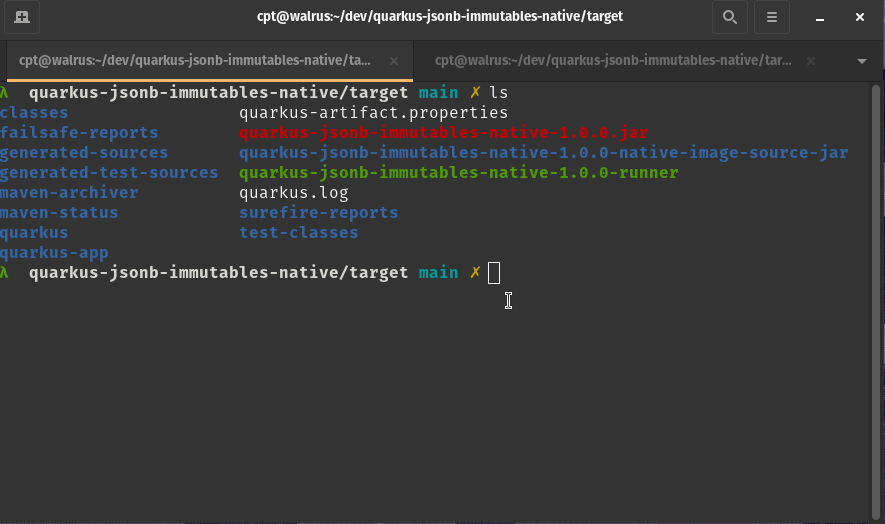

[](https://codecov.io/gh/josh-mchugh/quarkus-jsonb-immutables-native)

# Quarkus Jsonb Immutables Native

This project was put together to verify that Jsonb and Immutables would work together with Quarkus Native builds. This project is an extension of the [Quarkus + Immutables + Jsonb Project](https://github.com/josh-mchugh/quarkus-immutables-jsonb).

## Objective: 

Determine the requirements for using Jsonb and Immutables in a Quarkus Native application. 

## Approach: 

Create a simple project to demonstrate how to use Jsonb and Immutables in a RESTful JSON response with Quarkus Native. 

## Conclusion

Jsonb and Immutables can be used together in a Quarkus Native application and output a proper JSON response.

The Immutables Abstract Class will need to be annotated with `@RegisterForReflection` for it to generate JSON within the native build.

If the Immutables Abstract Class is not annotated with `@RegisterForReflection` it will return `{}` when the API is called within the native build.

Demostration GIF:


Immutables Abstract Class:
```java
package com.example;

import org.immutables.value.Value;

import io.quarkus.runtime.annotations.RegisterForReflection;

@Value.Immutable
@RegisterForReflection
public abstract class Greeting {
    
    public abstract String getMessage();
}
```

## Running the application in dev mode

You can run your application in dev mode that enables live coding using:
```shell script
./mvnw compile quarkus:dev
```

> **_NOTE:_**  Quarkus now ships with a Dev UI, which is available in dev mode only at http://localhost:8080/q/dev/.

## Packaging and running the application

The application can be packaged using:
```shell script
./mvnw package
```
It produces the `quarkus-run.jar` file in the `target/quarkus-app/` directory.
Be aware that it’s not an _über-jar_ as the dependencies are copied into the `target/quarkus-app/lib/` directory.

The application is now runnable using `java -jar target/quarkus-app/quarkus-run.jar`.

If you want to build an _über-jar_, execute the following command:
```shell script
./mvnw package -Dquarkus.package.type=uber-jar
```

The application, packaged as an _über-jar_, is now runnable using `java -jar target/*-runner.jar`.

## Creating a native executable

You can create a native executable using: 
```shell script
./mvnw package -Pnative
```

Or, if you don't have GraalVM installed, you can run the native executable build in a container using: 
```shell script
./mvnw package -Pnative -Dquarkus.native.container-build=true
```

You can then execute your native executable with: `./target/quarkus-jsonb-immutables-native-1.0.0-runner`

If you want to learn more about building native executables, please consult https://quarkus.io/guides/maven-tooling.
